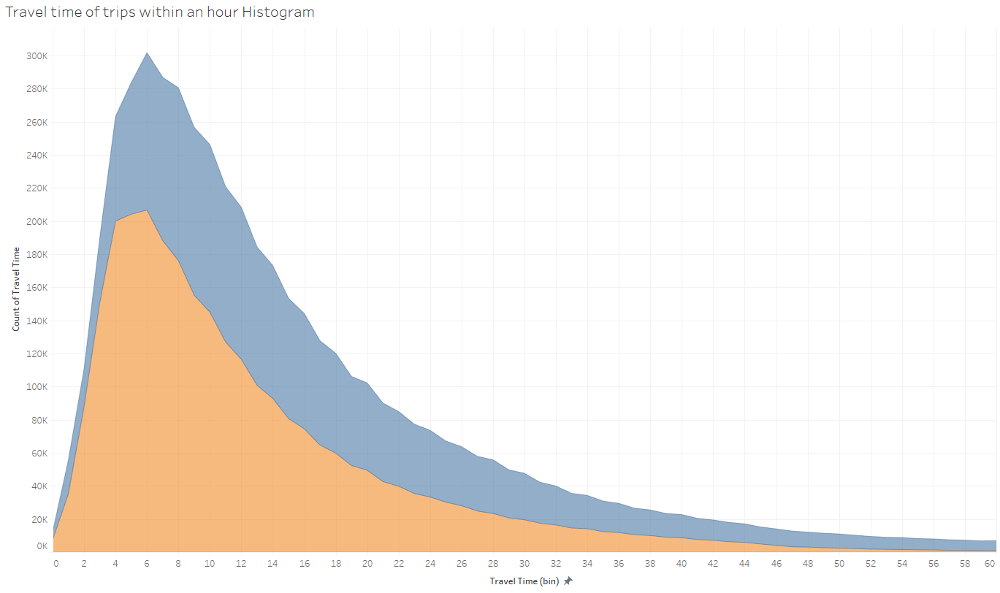
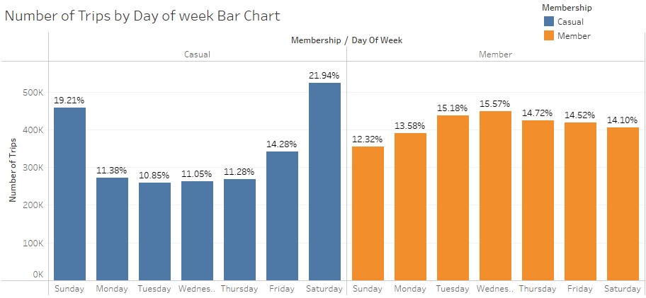
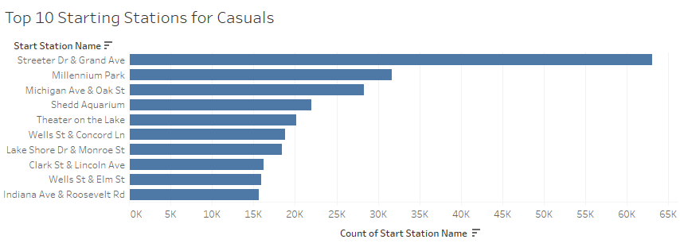
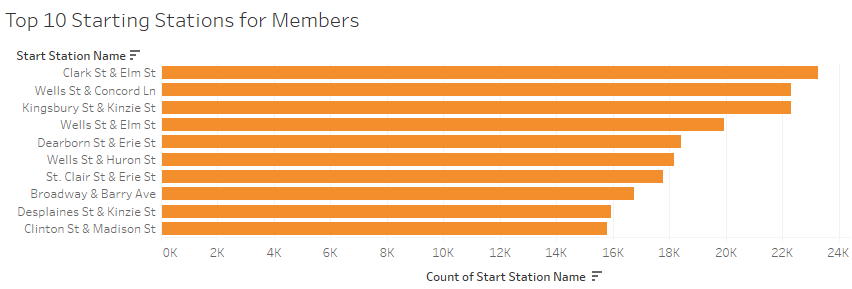

# Case Study: How Does a Bike-Share Navigate Speedy Success?
---

## Case Study Background
This case study is about a bike-share company Cyclystic. Cyclistic has three pricing plan: single-ride passes. full-day passes, and annual membership. Single-ride or full-day passes are referred to as casual riders. The goal of Cyclistic marketing team is to maximizing the number of annual memberships by converting casual riders into annual members. 

The key question of this case study is: How do annual members and casual riders use Cyclistic bikes differently.

## Data Source
The datasets used is the divvy-tripdata from Motivate Internation Inc. (as Cyclysitc is a frictional company) from January 2021 to December 2021.

There are 12 different csv files with data of different months of 2021.

## Importing the data
```python 
# Initialize
import pandas as pd
import numpy as np
import geopy.distance
import os
pwd = os.getcwd()

# Importing Data to a list of DataFrame
data = []
for i in range(12):
    filepath = pwd + "\DataSource/" + str(202101+i) + "-divvy-tripdata.csv"
    data += [pd.read_csv(filepath)]

# Check if the 12 DataFrame have same columns
for i in range(11):
    if  not data[11].columns.equals(data[i].columns):
        print("columns not identical")

# Checking if the 12 csv have the same columuns
for i in range(11):
    if  not data[11].columns.equals(data[i].columns):
        print("columns not identical")

# Merging the data
MergedData = pd.concat(data)

# Reset the index
MergedData.reset_index(drop = True)
```
## Data type of Columns

|Columns | Data type|
| ----------- | ----------- |
|ride_id           |            object|
|rideable_type     |            object|
|started_at        |    datetime64[ns]|
|ended_at          |    datetime64[ns]|
|start_station_name|            object|
|start_station_id  |            object|
|end_station_name  |            object|
|end_station_id    |            object|
|start_lat         |           float64|
|start_lng         |           float64|
|end_lat           |           float64|
|end_lng           |           float64|
|member_casual     |            object|
|TravelTime        |           float64|
|DayOfWeekint      |             int64|
|DayOfWeek         |            object|

## Data preprocesing 

1. Converting the data type of "started_at" and "ended_at" to datetime
```python
MergedData["started_at"] = pd.to_datetime(MergedData["started_at"])
MergedData["ended_at"] = pd.to_datetime(MergedData["ended_at"])
```
2. Adding a new column "TravelTime" representing the time used in each trip by minutes
```python
MergedData["TravelTime"] = ((MergedData["ended_at"] - MergedData["started_at"]).astype("timedelta64[s]") / 60).round(0)
```
3. Adding Columns "DayOfWeek" representing the day of week of the start date and "DayOfWeekint" representing the day of week by 0 as Monday and 6 as Sunday
```python
MergedData["DayOfWeekint"] = (MergedData["ended_at"].dt.dayofweek)
MergedData["DayOfWeek"] = MergedData["DayOfWeekint"].apply(lambda x:["Monday", "Tuesday", "Wednesday", "Thursday", "Friday", "Saturday", "Sunday"][x])
```
4. Adding a new column "Traveldistance" representing the distance between start and end station by meters
```python
def dist(slat, slng, elat, elng):
    for x in [slat, slng, elat, elng]:
        if np.isnan(x):
            return np.nan
    return geopy.distance.geodesic((slat, slng), (elat, elng)).m

MergedData["TravelDistance"] = MergedData.apply(lambda row: dist(row.start_lat, row.start_lng, row.end_lat, row.end_lng), axis = 1)
```

### Removing unwanted Data
#### Checking for duplicates
```python
MergedData[MergedData.duplicated()]
```
#### Checking Data Errors with started time after ended time.
```python
MergedData[MergedData["TravelTime"]<0]
```
As there are only a ignorable amount of rows of error we will omit the wrong data.
```python
MergedData = MergedData.drop(index = MergedData[MergedData["TravelTime"]<0].index)
```
#### Checking trips with same start and end station and time less than half a minute.
These trips are mostlikey be trips that is made by mistake. We will first analysis the number of these trips and remove these trip as they will be irrelevant for the analysis.
```python
NullTrips = MergedData[(MergedData["TravelDistance"] == 0) & (MergedData["TravelTime"] == 0)]
print("Total number of trips :", MergedData["ride_id"].size)
print("Total number of trips made by mistake:", NullTrips["ride_id"].size,"  Percentage: {:.3%}".format(NullTrips["ride_id"].size / MergedData["ride_id"].size))
print("Number of trips made by mistake:")
df = NullTrips.groupby("member_casual")["ride_id"].size().reset_index()
df = df.rename(columns = {"ride_id":"Number_of_trips"})
df["Percentage"] = (df["Number_of_trips"] / df["Number_of_trips"].sum()*100).round(2)
print(df)
```
Total number of trips : 5594312
Total number of trips made by mistake: 42838   Percentage: 0.766%
Number of trips made by mistake:

|member_casual|	Number_of_trips	|Percentage|
| ----------- | ----------- | ----------- |
|casual | 17165 | 40.07|
|member | 25673 | 59.93|

#### Removing trips that are made by mistake
```python
MergedData = MergedData.drop(index = MergedData[(MergedData["TravelDistance"] == 0) & (MergedData["TravelTime"] == 0)].index)
```
#### Removing Columns start_lat, start_lng, end_lat, and end_lng as we will not be using these columns in our analysis.
```python
MergedData = MergedData.drop(columns = ["start_station_id", "end_station_id", "start_lat", "start_lng", "end_lat", "end_lng"])
```
#### Export data for Analysis and Visualization in Tableau
```python
MergedData.to_csv("ProcessedData.csv")
```

## Analysis

### Number of trip by Membership
1. Members have about 20% more trips than Casuals.

2. Most trip starts and end at the same day in a different station.

3. Most trip starts and end in a different station.

4. For trips that start and end at different dates, Casuals have about 3 times more trips than Members.

5. For trips that start and end at the same station, Members have about half the number of trips for Casuals.


### Travel time by Membership

- Most of the trips are around 6 minutes long.
- From the histogram, both membership have similar shape of distribution with Casuals having more trips in any given travel time.


- The Average Travel time of Casuals are 42% more than Members.

- Casuals and Members behave similiarly for trips within an hour, the great difference in average travel time can be explained below:
1. The max travel time of Casuasl (55944) is much greater than Members (1560) 
2. 8.8% of trips for Casuals are over an hour while less than 1% of trips for Members are over an hour
3. So there are many Casual trips with high travel time contribute to the high average time for Casuals.


### Trips and Travel time by day of week

- For Casuals, more trips are on weekends and Fridays than in weekdays.
- For Members, number of trips are similiar across the week with less trips in Sundays and Mondays.



- For Casuals, trips are longer on Sundays and Mondays.
- For Members, the travel time are similiar across the week with longer trips in weekends.


### Top 10 Starting Station


